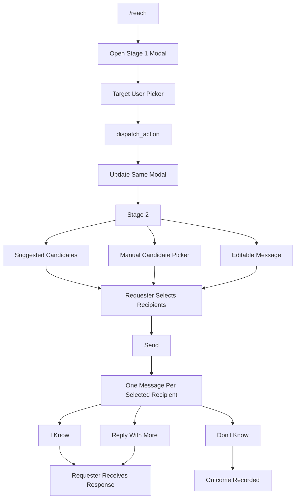
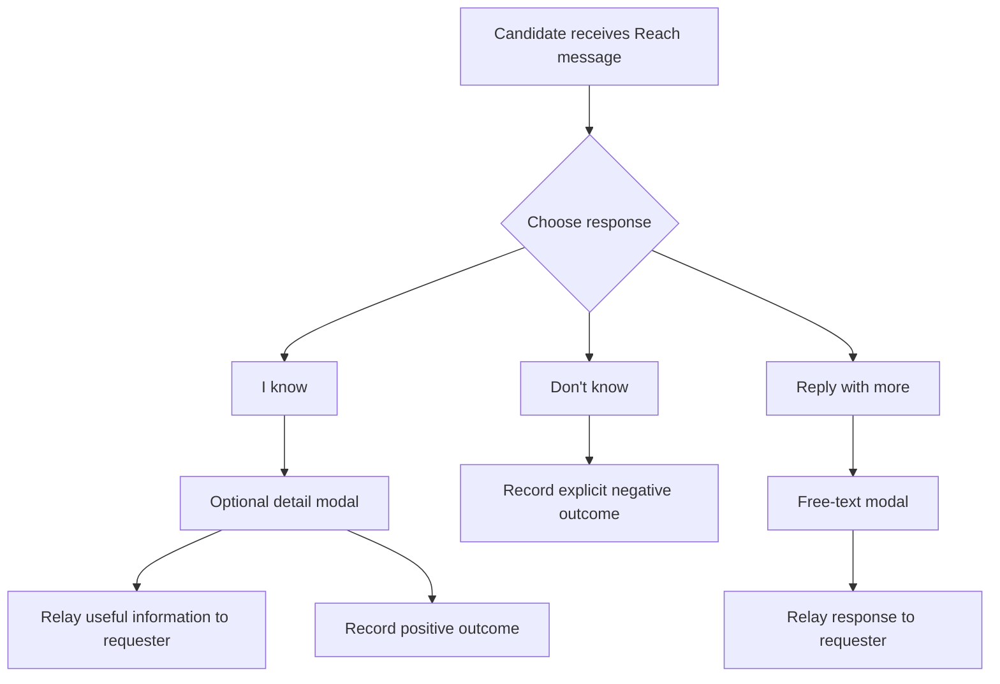
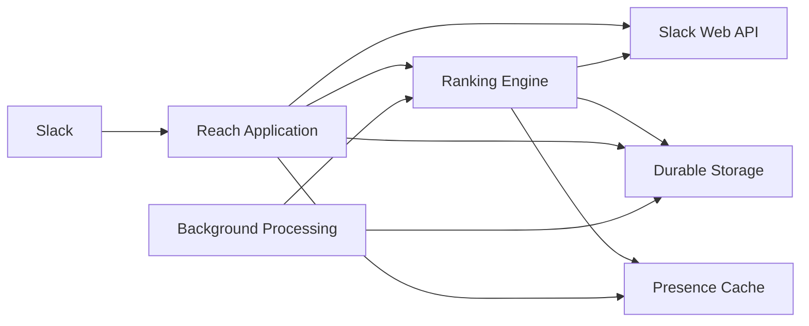
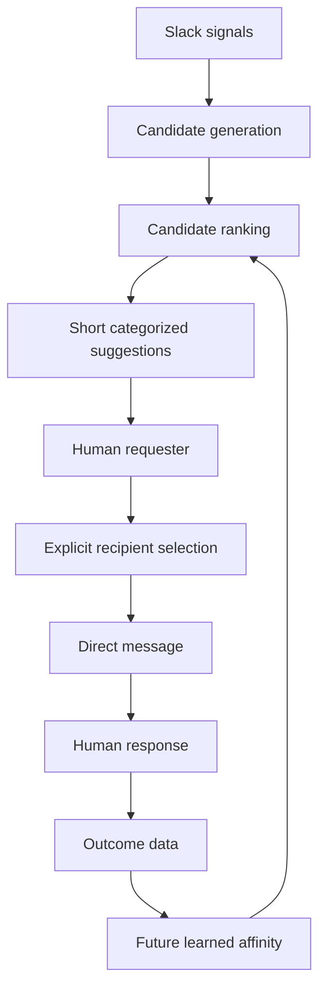

# Technical Specification — Slack "Reach" Bot

**Companion to `AGENTS.md` (product/UX specification).**

`AGENTS.md` is the source of truth for product behavior, UX, scope, privacy boundaries, and v1/v2 priorities. This document defines the technical architecture, data model, interfaces, implementation boundaries, and build sequence required to realize that behavior.

Where this document conflicts with `AGENTS.md`, `AGENTS.md` wins.

---

## 1. System Overview

The Slack Reach bot helps a requester reach a person without posting into a shared channel.

The system:

1. Receives `/reach`.
2. Opens a two-stage modal.
3. Lets the requester select a target user.
4. Generates a short list of candidates using Slack-visible signals.
5. Groups candidates by current presence.
6. Lets the requester select suggested candidates and optionally add additional people manually.
7. Sends one composed message to every selected recipient.
8. Gives every recipient three low-friction response actions.
9. Routes useful responses back to the requester.
10. Records outcomes for future learned-affinity ranking in v2.

The bot does **not** locate the target itself and does not automatically escalate or message people without explicit requester approval.

The system's optimization goal is to minimize unnecessary interruptions while surfacing people who are structurally or contextually likely to help.

---

## 2. Product Boundaries

### 2.1 Privacy boundary

The bot may use only information exposed through Slack APIs that falls within the project's defined public-information boundary:

- User presence.
- Public channel membership.
- Public thread activity.

The bot must not read:

- Private DMs belonging to other users.
- Private DM content.
- Other private conversational content outside the permitted Slack API boundary.

Relational signals must therefore be derived from public channels and public threads available to the bot.

---

### 2.2 Human approval boundary

The bot never autonomously sends an escalation.

The requester explicitly decides who receives the final message.

The system may recommend candidates, but the requester remains responsible for selecting recipients and sending the composed message.

---

### 2.3 Delivery boundary

The default delivery mechanism is **bot-relay**.

Messages are sent using the bot identity and clearly communicate that the bot is relaying a request for the requester.

Sending as the requester is an optional v2 feature and requires explicit per-user authorization.

---

## 3. Core Interaction Architecture

The primary Slack interaction is a single modal containing two stages.

There is no intermediate channel message followed by a second interaction.



### 3.1 Stage 1

The `/reach` slash command opens a modal immediately.

Stage 1 contains:

- One user picker.
- Label: `Who are you trying to reach?`

No arguments are required for `/reach`.

The target selection triggers a Slack `dispatch_action`.

The application responds by updating the same modal using `views.update`.

---

### 3.2 Stage 2

Stage 2 contains three conceptual areas.

#### Suggested candidates

Candidates are:

- Generated by the ranking engine.
- Pre-ranked.
- Grouped by presence.
- Presented as checkboxes.
- Limited to the configured total candidate cap.
- Pre-checked for the top 1–2 candidates.

Presence groups:

- Active now.
- Offline.

The presentation layer does not independently rank or filter candidates.

---

#### Manual candidates

A `multi_users_select` field allows the requester to add people they believe may be near the target.

This field:

- Is optional.
- Has no algorithmic candidate cap.
- Is clearly distinguished from suggested candidates.
- Represents explicit human knowledge rather than ranking output.

Manually added candidates are included in the final recipient set.

---

#### Message

A single `plain_text_input` contains a default message.

The requester may edit it.

The same composed message is sent to every selected recipient.

---

### 3.3 Submission

When the requester presses **Send**:

1. Suggested candidates that are checked are collected.
2. Manually added candidates are collected.
3. The two sets are deduplicated.
4. One message is sent to every resulting recipient.
5. A `Ping` record is created for each actual recipient.
6. The recipient receives the message with the three response actions.

No public channel post is generated.

---

## 4. Candidate Generation

Candidate generation uses independent signals.

The system must preserve the distinction between structural and temporal/contextual proximity.

### 4.1 Presence

Presence is the primary sorting/bucketing axis.

Presence can be obtained through:

- `users.getPresence`
- Slack presence-change events where appropriate.

Presence may be cached briefly to avoid excessive Slack API calls.

The ranking result must expose:

```text
active
offline
```

as separate candidate groups.

---

### 4.2 Shared channel membership

For the target user, determine the public channels they belong to.

For each relevant channel:

1. Determine eligible co-members.
2. Determine the channel size.
3. Use channel size as a weighting factor.

Smaller shared channels provide a stronger structural signal than large shared channels.

Conceptually:

```text
shared small channel
        ↓
stronger proximity signal

shared large channel
        ↓
weaker proximity signal
```

The implementation should preserve this signal as `channel_proximity`.

---

### 4.3 Thread co-occurrence

Thread co-occurrence is a separate signal.

It uses public threads where:

- The target participated.
- Another user also participated.
- The activity falls within the configured recency window.

Default recency window:

```text
7 days
```

This signal is named:

```text
thread_recency
```

It must not be merged into channel membership during candidate generation.

Thread co-occurrence is a **v2 feature** and therefore must not affect v1 ranking.

---

### 4.4 Learned affinity

Learned affinity is also a v2 feature.

The system records recipient outcomes so that historical `(target, candidate)` relationships can eventually influence ranking.

A candidate must have enough historical samples before learned affinity affects ranking.

Default threshold:

```text
3 samples
```

Below the threshold, learned affinity is ignored.

Manually added candidates that subsequently produce positive outcomes should receive stronger training weight because the requester explicitly vouched for that candidate.

The precise learning algorithm is intentionally simple initially. A basic decayed average is sufficient; the system should not introduce a complex model before real usage data exists.

---

## 5. Candidate Ranking

The ranking engine should be implemented as a pure, testable component.

Conceptual interface:

```text
rankCandidates(targetId, requesterId)
    -> {
        active: Candidate[],
        offline: Candidate[]
    }
```

The ranking engine should not send Slack messages, modify the modal, or perform unrelated side effects.

---

### 5.1 v1 ranking

v1 uses:

- Presence.
- Shared public channel membership weighted by channel size.

v1 does **not** use:

- Thread co-occurrence.
- Learned affinity.

The candidate ranking should therefore remain deterministic and explainable from the structural signals available at this stage.

---

### 5.2 v2 ranking

v2 adds:

- Thread co-occurrence with recency decay.
- Learned affinity once sufficient historical samples exist.

The learned affinity acts as a boost rather than replacing structural signals entirely.

Conceptually:

```text
static structural signals
        +
temporal/contextual signal
        +
eligible learned affinity
        ↓
candidate ordering
        ↓
presence buckets
        ↓
candidate cap
```

The user-facing UI does not expose an overall relevance score.

---

### 5.3 Candidate cap

The suggested list is intentionally short.

Default:

```text
~5–6 candidates total
```

The cap applies across both presence groups.

It is **not** a cap of three active plus three offline candidates.

The manual `multi_users_select` field has no equivalent algorithmic cap.

The exact value remains configurable and should be adjusted after real-world usage.

---

## 6. Data Model

The durable data model exists primarily to support:

- Request/message tracking.
- Outcome tracking.
- Future learned affinity.

The schema should distinguish an actual sent ping from a candidate merely being displayed.

### 6.1 Reach request

A request represents one `/reach` interaction.

Conceptual fields:

```text
ReachRequest
------------
id
requesterId
targetId
createdAt
```

This establishes the relationship between the requester and the target independently of individual recipients.

---

### 6.2 Ping

A ping represents a message actually sent to a selected recipient.

```text
Ping
----
id
reachRequestId
requesterId
targetId
candidateId
presenceAtPing
createdAt
```

Optional contextual metadata may include the signal that caused the candidate to be surfaced, where useful for internal analysis.

A `Ping` should be created when the requester explicitly sends the message, not merely because someone appeared in the suggestion list.

This preserves the distinction between:

- Candidate was suggested.
- Candidate was selected.
- Candidate actually received a message.

---

### 6.3 Ping outcome

Each ping can have an outcome.

```text
PingOutcome
-----------
id
pingId
outcome
respondedAt
responseLatencySeconds
```

The outcome vocabulary should reflect the actual recipient actions.

Conceptually:

```text
I know
    ↓
positive/helpful outcome

Don't know
    ↓
explicit negative outcome

Reply with more
    ↓
free-text response
```

A timeout/no-response state may be recorded separately from an explicit negative response.

This distinction matters because:

```text
No response
    ≠
Explicitly does not know
```

They should not be treated as the same training signal.

---

### 6.4 Affinity score

v2 maintains one learned relationship per target/candidate pair.

```text
AffinityScore
-------------
targetId
candidateId
score
sampleSize
lastUpdated
```

Conceptually:

```text
(target, candidate)
        ↓
historical outcomes
        ↓
decayed aggregation
        ↓
AffinityScore
```

The score must remain internal to ranking.

It must never be presented as:

- A leaderboard.
- A reputation score.
- A "most interruptible" metric.
- A public ranking of people.

---

## 7. Outcome Handling

Every outgoing Reach message contains the same three recipient-side actions.

### 7.1 "I know"

Records a positive outcome.

The implementation may open a small one-field modal requesting useful information such as where/how the target can be reached.

That information is then relayed to the requester.

The product direction currently leans toward collecting the useful detail rather than silently recording the positive outcome.

---

### 7.2 "Don't know"

Records an explicit negative outcome.

This is different from receiving no response.

The event contributes to the historical outcome data used by the v2 learning system.

---

### 7.3 "Reply with more"

Opens a one-field modal for free-text input.

The response is relayed to the original requester as a DM.

---

### 7.4 Outcome routing

Recipient interaction:



---

## 8. Delivery Modes

### 8.1 v1: bot-relay

v1 supports only bot-relay delivery.

The message is sent from the bot identity.

The message must clearly establish:

- Who is requesting help.
- That the bot is relaying the request.
- The requester's composed message.

Example conceptual framing:

```text
Reach, relaying for @Requester:

<message>
```

The exact copy belongs to the product/UX layer.

---

### 8.2 v2: send-as-yourself

Sending as the requester is a v2 feature.

It requires:

- Per-user OAuth authorization.
- A user-scoped credential.
- Explicit user consent.
- Settings in the Slack App Home.

The bot must never make this authorization mandatory for `/reach`.

If authorization is absent or disconnected:

```text
send-as-yourself
        ↓ unavailable
bot-relay
        ↓
message still works
```

---

### 8.3 Settings

The v2 Settings tab must expose:

- Current delivery mode.
- Bot-relay / send-as-yourself toggle.
- Connect/disconnect action.
- Plain-language explanation of the permission.
- Automatic fallback to bot-relay after disconnect.

Disconnecting affects future messages only.

Previously sent messages are unaffected.

---

## 9. Slack App Surface

### 9.1 `/reach`

The slash command takes no required arguments.

```text
/reach
```

The command:

1. Verifies the Slack request.
2. Opens Stage 1 of the modal.
3. Does not post a public-channel message.

---

### 9.2 Target selection

The target user picker uses Slack's user-selection component.

The field uses `dispatch_action`.

When the target changes:

```text
target selected
      ↓
dispatch_action
      ↓
candidate generation
      ↓
candidate ranking
      ↓
views.update
      ↓
Stage 2 rendered
```

The same modal is updated in place.

---

### 9.3 Stage 2 rendering

The application renders:

- Suggested candidate checkboxes.
- Active/offline grouping.
- Optional manual multi-user picker.
- Editable message field.
- Send action.

The presentation layer receives already-ranked candidates.

It must not independently calculate relevance.

---

### 9.4 Send submission

On submission:

1. Validate the selected target.
2. Collect checked suggested candidates.
3. Collect manually added candidates.
4. Deduplicate recipients.
5. Generate the final message.
6. Send one message to every selected recipient.
7. Persist one `Ping` per actual recipient.
8. Attach the three response actions.

No public-channel message is sent.

---

### 9.5 Recipient actions

The outgoing message exposes:

```text
I know
Don't know
Reply with more
```

Each action is associated with its corresponding `Ping`.

The action handler must be able to identify:

```text
pingId
reachRequestId
requesterId
targetId
candidateId
```

without requiring the user to manually provide this context.

---

## 10. Presence Cache

Presence may be cached temporarily.

Conceptual Redis key:

```text
presence:{userId}
```

Value:

```text
active
offline
```

Suggested TTL:

```text
30–60 seconds
```

The cache is ephemeral.

Presence cache data is not persisted to the durable database.

On cache miss, the system may query Slack and repopulate the cache.

---

## 11. Configuration

Values expected to change through real usage should be configuration rather than hardcoded.

Initial configuration includes:

```text
MAX_SUGGESTED_CANDIDATES
THREAD_RECENCY_DAYS
MIN_SAMPLE_THRESHOLD
AFFINITY_DECAY_HALFLIFE_DAYS
PRESENCE_CACHE_TTL
```

Suggested initial values:

```text
MAX_SUGGESTED_CANDIDATES = 5–6
THREAD_RECENCY_DAYS = 7
MIN_SAMPLE_THRESHOLD = 3
AFFINITY_DECAY_HALFLIFE_DAYS = 30
PRESENCE_CACHE_TTL = 30–60 seconds
```

The exact candidate cap remains an open product decision.

---

## 12. Background Processing

Background processing is only required for features that cannot reasonably be completed synchronously.

### v1

v1 should not require a learned-ranking pipeline.

It may record outcome data so that the system has historical data available for v2.

### v2

v2 introduces an aggregation process that:

1. Reads historical outcomes.
2. Groups them by `(targetId, candidateId)`.
3. Applies recency decay.
4. Produces an affinity score.
5. Updates `sampleSize`.
6. Makes the score available to the ranking engine.

A simple exponentially decayed average is sufficient initially.

Do not introduce a sophisticated ML/Bayesian system without evidence that the collected data requires it.

---

## 13. Technology Decisions

The implementation technology is intentionally **not locked by this specification**.

`AGENTS.md` explicitly leaves the choice between Node and Python as an open decision.

Therefore this document must not prematurely require:

- Python.
- Node.js.
- A particular Slack framework.
- Prisma.
- Psycopg.
- A particular scheduler.
- A particular deployment runtime.

The implementation team/coding agent should confirm the stack before scaffolding.

The architectural requirements remain independent of that choice:



---

## 14. v1 Implementation Scope

v1 must implement the smallest complete version of the actual product flow.

### Required

1. `/reach` slash command.
2. Stage 1 target picker.
3. In-place modal update.
4. Stage 2 candidate suggestions.
5. Presence grouping.
6. Shared-channel-size ranking.
7. Suggested candidate checkboxes.
8. Top 1–2 candidates pre-checked.
9. Manual multi-user picker.
10. Editable default message.
11. Recipient deduplication.
12. Bot-relay delivery.
13. Three recipient response actions.
14. Outcome logging.
15. Privacy and no-public-channel guardrails.

### Not required in v1

- Thread co-occurrence ranking.
- Learned affinity ranking.
- Send-as-yourself.
- Per-user OAuth.
- Settings tab.
- "Why these people" detail view.

---

## 15. v2 Implementation Scope

After v1 has been validated through actual usage:

1. Add thread co-occurrence with recency decay.
2. Add learned affinity.
3. Apply sample-size gating.
4. Give manually vouched candidates stronger learning weight.
5. Add send-as-yourself delivery.
6. Add per-user OAuth.
7. Add App Home Settings.
8. Add opt-in "Why these people" information.
9. Improve aggregation based on real outcome data.

---

## 16. "Why These People" Architecture

The default UI does not show ranking explanations.

If the feature is implemented in v2, the ranking engine should return enough internal evidence to support an optional explanation.

Conceptually:

```text
Candidate
├── presence
├── channel_proximity
├── thread_recency
└── learned_affinity
```

The explanation layer should consume the evidence already produced by ranking.

It must not independently recompute ranking.

The default suggestion interface remains minimal.

---

## 17. Guardrails

These constraints are mandatory.

### 17.1 No public-channel escalation

The bot must never post a Reach request into a public channel on behalf of the requester.

The flow is:

```text
Requester
    ↓
Private modal
    ↓
Requester chooses recipients
    ↓
Direct messages only
```

---

### 17.2 No autonomous messaging

The bot must not send a message merely because it identified a candidate.

A candidate must be explicitly selected by the requester.

---

### 17.3 No private DM access

The ranking system must never depend on private DMs.

All relational signals must originate from permitted Slack-visible sources.

---

### 17.4 No visible reputation system

Learned affinity must remain an internal ranking signal.

Never expose:

- Individual affinity scores.
- Candidate leaderboards.
- "Most helpful" rankings.
- "Most interruptible" rankings.
- Visible response-rate reputations.

---

### 17.5 Minimal interruption

The UI should remain optimized for:

```text
open
→ select target
→ review a few candidates
→ send
```

The candidate list should remain short enough to scan immediately.

The tool should never become more cumbersome than simply posting a channel message.

---

## 18. Testing Requirements

The architecture should make the following components independently testable.

### Ranking tests

Test:

- Presence grouping.
- Shared-channel weighting.
- Small-channel preference over large-channel membership.
- Candidate cap.
- Deduplication.
- Exclusion of the target itself.
- Exclusion of the requester where appropriate.
- v1 exclusion of thread/affinity signals.
- v2 sample-threshold behavior.

### Modal tests

Test:

- `/reach` opens Stage 1.
- Target selection triggers Stage 2.
- Stage 2 replaces the same modal.
- Suggested candidates are pre-ranked.
- Top candidates are pre-checked.
- Manual candidates can be added.
- Suggested and manual candidates are deduplicated.
- Message remains editable.

### Delivery tests

Test:

- Only explicitly selected recipients receive messages.
- No public channel message is generated.
- Bot-relay framing identifies the requester.
- One message is sent per unique recipient.
- Each message contains all three actions.

### Outcome tests

Test:

- `I know` records a positive outcome.
- `Don't know` records an explicit negative outcome.
- `Reply with more` routes free text to the requester.
- No-response remains distinguishable from explicit negative feedback.
- Each outcome maps to the correct ping.

### Privacy tests

Test that:

- Private DM content is never requested.
- Private DM content is never used for ranking.
- Affinity data is never exposed as a user-facing leaderboard or reputation metric.

---

## 19. Build Sequence

Build the system in the following order.

### Phase 1 — Core interaction

1. Confirm implementation stack.
2. Establish Slack app and `/reach`.
3. Implement Stage 1 modal.
4. Implement target selection.
5. Implement in-place Stage 2 update.

### Phase 2 — v1 ranking

6. Implement public channel membership retrieval.
7. Implement channel-size weighting.
8. Implement presence retrieval/cache.
9. Implement candidate grouping.
10. Implement candidate cap.
11. Implement pure ranking tests.

### Phase 3 — v1 delivery

12. Implement suggested candidate checkboxes.
13. Implement manual candidate picker.
14. Implement editable message field.
15. Implement recipient deduplication.
16. Implement bot-relay delivery.
17. Persist actual pings.

### Phase 4 — v1 outcomes

18. Implement `I know`.
19. Implement `Don't know`.
20. Implement `Reply with more`.
21. Route responses to the requester.
22. Persist outcome data.

At this point v1 is complete.

---

### Phase 5 — v2 learning

23. Implement thread co-occurrence.
24. Add recency decay.
25. Implement affinity aggregation.
26. Add sample-size gating.
27. Integrate learned affinity as a ranking boost.
28. Add stronger learning weight for manually added candidates.

### Phase 6 — v2 delivery

29. Implement per-user OAuth.
30. Implement send-as-yourself mode.
31. Implement App Home Settings.
32. Implement bot-relay fallback.

### Phase 7 — v2 explanation

33. Implement opt-in "Why these people".
34. Surface ranking evidence without exposing internal scores or reputation metrics.

---

## 20. Open Decisions

The following remain intentionally unresolved because `AGENTS.md` does not finalize them:

### Technology stack

Node vs Python remains open.

Confirm before scaffolding.

### Candidate cap

Initial proposal:

```text
5–6 total
```

Tune after real usage.

### Thread recency

Initial proposal:

```text
7 days
```

Make configurable and adjust based on usage.

### "I know" behavior

The current direction leans toward asking for useful location/detail information rather than merely recording a positive outcome.

This should be confirmed during implementation.

### Send-as-yourself authorization

The exact OAuth scopes and authorization flow should be finalized when v2 is implemented.

---

## 21. Final Architecture Principle

The Reach bot is intentionally a **decision-support system**, not an autonomous escalation system.

Its technical architecture should preserve this distinction:



The system becomes more useful through feedback, but the final decision about who gets interrupted remains with the requester.
